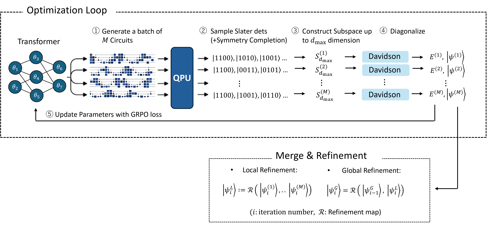

# Generative Circuit Design for Quantum-Selected Configuration Interaction

Training pipeline for **GQE (Generative Quantum Eigensolver) + QSCI (Quantum-Selected Configuration Interaction)** on molecular Hamiltonians.  
The entrypoint is `train.py` (Hydra), and quantum-circuit sampling is performed with **CUDA-Q**.
For more details, please refer to the full paper: Generative Circuit Design for Quantum-Selected Configuration Interaction.




## Requirement
- Python `>=3.10` (see `pyproject.toml`)
- Docker is the recommended setup, using the provided `dockerfile` based on `ghcr.io/nvidia/cudaqx:0.4.0`
- GPU acceleration requires an NVIDIA GPU with CUDA 12.8 support
- CPU-only execution is also supported

## Installation (local)

This repository’s `Dockerfile` is based on `ghcr.io/nvidia/cudaqx:0.4.0`.

### build

For a CPU-only environment, build the image without specifying `TORCH_INDEX_URL`:

```bash
docker build -t gqe_qsci .
```

For a GPU environment, specify the CUDA-enabled PyTorch index URL:

```bash
docker build \
  --build-arg TORCH_INDEX_URL=https://download.pytorch.org/whl/cu128 \
  -t gqe_qsci .
```

### run

For CPU-only execution:

```bash
docker run -it --rm \
  -v "$(pwd):/workspace" \
  -w /workspace \
  gqe_qsci
```

For GPU execution:

```bash
docker run -it --rm \
  --gpus all \
  -v "$(pwd):/workspace" \
  -w /workspace \
  gqe_qsci
```
## Running (basic)

Hydra configs live under `configs/`. You can override them via `group=name` and/or `key=value`:

```bash
python train.py molecule=n2 trainer.epochs=200
```


## Outputs and resuming (checkpoints / W&B)

By default (`configs/default.yaml`), outputs are written to:
- **Output dir**: `outputs/${project.name}/${exp_tag}`
- **Checkpoint**: `.../models/last.ckpt` (loaded if present)
- **Replay buffer**: `.../buffer.pkl`
- **W&B run id**: `.../run_id` (re-running in the same directory resumes with `resume='allow'`)

To resume:
- Run with the same `exp_tag` (i.e., the same `output` directory)
- Keep `trainer.load_checkpoint=true` (default)

Example (pin `exp_tag` for easy resuming):

```bash
python train.py molecule=n2 exp_tag=my-n2-run
```

To start fresh (do not load checkpoints):

```bash
python train.py trainer.load_checkpoint=false
```

## Upstream reference and attribution

This implementation is based in part on the CUDA-QX contribution proposed in
[NVIDIA/cudaqx PR #373](https://github.com/NVIDIA/cudaqx/pull/373).

In particular, the present codebase was informed by the upstream work on:

- GRPO-based training
- replay-buffer-based training flow
- variance-based temperature scheduling
- a modular training pipeline built on PyTorch Lightning


We gratefully acknowledge **NVIDIA** and the **CUDA-QX** contributors for making that work publicly available. Their engineering work and open development greatly helped this research codebase.


## License

This repository is distributed under the **Apache License 2.0**.

Because this project was developed with reference to, and may include derivative work from, **NVIDIA/cudaqx**, the repository keeps the corresponding license and attribution information in the top-level `LICENSE` and `NOTICE` files. If you redistribute or modify this code, please preserve those notices and clearly indicate your changes in modified files.

## Acknowledgments

A part of this work was performed for the Council for Science, Technology and Innovation (CSTI), Cross-ministerial Strategic Innovation Promotion Program (SIP), “Promoting the application of advanced quantum technology platforms to social issues” (funding agency: QST). The results presented in this work were obtained using the ABCI-Q of AIST G-QuAT.
RK would like to express gratitude to Kenji Sugisaki for insightful discussion.
